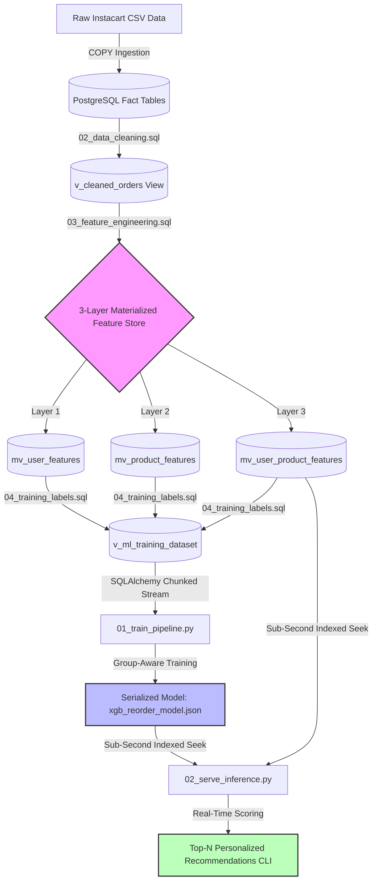
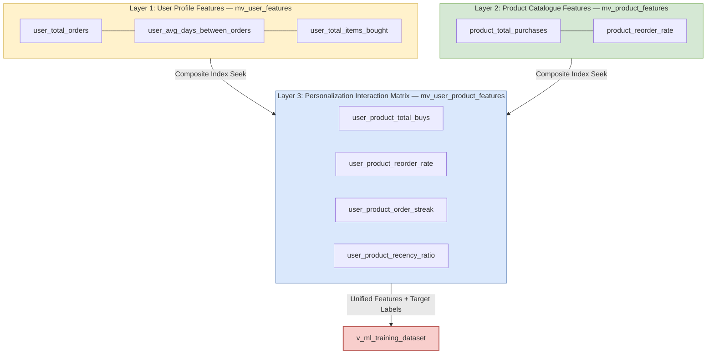

# 🛒 E-Commerce Real-Time Feature Store for AI Models - MLOPs

### *A Production-Grade PostgreSQL + XGBoost MLOps Pipeline for Personalized Reorder Prediction at Scale*

<br>


## 📋 Table of Contents

1. [Project Overview](#-project-overview)
2. [Dataset & Scale](#-dataset--scale)
3. [Repository Structure](#-repository-structure)
4. [System Architecture & Data Flow](#-system-architecture--data-flow)
5. [Database Layer: Schema Design](#-database-layer-schema-design)
6. [Three-Layer Feature Store](#-three-layer-feature-store)
7. [Advanced ML Engineering](#-advanced-ml-engineering)
8. [Model Training Pipeline](#-model-training-pipeline)
9. [Model Performance & Evaluation](#-model-performance--evaluation)
10. [Real-Time Serving & Inference](#-real-time-serving--inference)
11. [Setup & Execution Guide](#-setup--execution-guide)
---

## 🎯 Project Overview

This project builds an **industry-standard machine learning feature store** from scratch — the same architectural pattern used internally at Instacart, DoorDash, and Uber Eats to power real-time product recommendations.

The core engineering challenge: given a user's complete purchase history across 33 million transaction records, predict — with calibrated probability — which specific products they will reorder in their *next* basket.

This is not a notebook experiment. Every component reflects a deliberate production engineering decision:

- **Schema design** with strict type constraints, composite primary keys, and FK cascade strategies that protect data integrity at ingestion time
- **Feature engineering** using window functions (`ROW_NUMBER`, `LAG`), CTE chains, and materialized views that pre-compute expensive aggregations once and serve them in microseconds
- **ML pipeline design** with group-aware train/test splitting, dynamic class imbalance correction, and early stopping to prevent overfitting — all documented with the *why*, not just the *how*
- **Inference architecture** that separates offline pre-computed features from online request-time context, exactly mirroring how production feature stores like Feast and Tecton operate

**Final model performance: ROC-AUC = 0.7971** — correctly ranking a reordered product above a non-reordered one ~80% of the time across 8.47 million scored candidate pairs.

---

## 📊 Dataset & Scale

**Source:** [Instacart Market Basket Analysis](https://www.kaggle.com/c/instacart-market-basket-analysis) — Kaggle

| Table | Description | Row Count |
|---|---|---|
| `aisles` | Store aisle lookup | 134 |
| `departments` | Department taxonomy | 21 |
| `products` | Product catalog (SKUs) | 49,688 |
| `orders` | Transaction log per user | 3,421,083 |
| `order_products` | Line-item fact table (prior + train) | **33,819,106** |

**ML Training Matrix (post feature engineering):**

| Metric | Value |
|---|---|
| Total candidate (user, product) pairs scored | **8,470,000+** |
| Positive labels (reordered = 1) | ~9.76% |
| Negative labels (not reordered = 0) | ~90.24% |
| Computed `scale_pos_weight` | **9.25** |
| Unique users in training split | ~131,000 |
| Unique users in test split | ~33,000 |

---

## 🗂 Repository Structure

```
ecommerce_realtime_feature_store_sql/
│
├── data/                               # Raw Kaggle CSVs (not tracked in Git)
│   ├── aisles.csv
│   ├── departments.csv
│   ├── products.csv
│   ├── orders.csv
│   ├── order_products__prior.csv       # ~32M rows / 564 MB
│   └── order_products__train.csv       # ~1.4M rows / 24 MB
│
├── sql_scripts/
│   ├── 01_schema.sql                   # Schema definition + bulk COPY ingestion
│   ├── 02_data_cleaning.sql            # v_cleaned_orders: NULL imputation + OHE
│   ├── 03_feature_engineering.sql      # Three-layer materialized feature store
│   └── 04_training_labels.sql          # v_ml_training_dataset: unified ML matrix
│
├── ml_pipeline/
│   ├── 01_training_pipeline.py            # XGBoost training + evaluation + serialisation
│   └── xgb_reorder_model.json          # Serialised booster artifact (XGBoost native JSON)
│   └── 02_serve_inference.py           # Real-time feature serving + inference engine
│
└── README.md
```

---

## 🏗 System Architecture & Data Flow

The pipeline is structured as six sequential phases, each producing a stable artifact consumed by the next. Every arrow below represents a hard dependency — a file that cannot execute correctly unless the upstream artifact exists and is valid.



**Key design principle — artifact stability:** Each phase writes a durable output (a table, view, materialised view, or model file) that persists independently of the process that created it. This means any single phase can be re-executed or upgraded in isolation without rerunning the full pipeline — critical for iterating on feature engineering without re-ingesting 33M rows.

---

## 🗄 Database Layer: Schema Design

### Why Strict Typing Over Generic `TEXT`

Every column is assigned the smallest adequate data type — not out of pedantry, but because type width directly determines index size, cache efficiency, and join performance at 33M-row scale.

| Column | Chosen Type | Rationale |
|---|---|---|
| `aisle_id`, `department_id` | `SMALLINT` (2 bytes) | Only 134/21 distinct values. Saves ~62MB across 33M rows vs `INTEGER` |
| `order_id`, `product_id` | `INTEGER` (4 bytes) | Millions of rows; BIGINT range is unnecessary overhead |
| `reordered` | `SMALLINT CHECK IN (0,1)` | Stays numeric for ML frameworks; no casting at training time |
| `days_since_prior_order` | `NUMERIC(5,1)` | Preserves one decimal place from source; avoids float imprecision |
| `eval_set` | `CHAR(5)` | Fixed-width categorical code; no storage waste vs `VARCHAR` |

### Composite Primary Key on the Fact Table

`order_products` uses `PRIMARY KEY (order_id, product_id)` — a deliberate choice over a surrogate `SERIAL` key:

- **Storage:** On 33M rows, eliminating a 4-byte surrogate saves ~132MB of index space
- **Query performance:** The composite PK *is* the most frequent join key; PostgreSQL can satisfy `WHERE order_id = ? AND product_id = ?` with a single index seek, no heap fetch required
- **Data integrity:** Prevents duplicate line items at the database engine level, not the application level

### FK Cascade Strategy

```sql
-- order → order_products: CASCADE
-- Purging an order removes its line items. Orphan line items would silently
-- corrupt feature aggregations by counting products for non-existent orders.
CONSTRAINT fk_order_products_orders FOREIGN KEY (order_id)
    REFERENCES orders(order_id) ON DELETE CASCADE,

-- product → order_products: RESTRICT
-- Deleting a product with purchase history would silently corrupt user
-- reorder rate calculations. RESTRICT surfaces this as an error, not silence.
CONSTRAINT fk_order_products_products FOREIGN KEY (product_id)
    REFERENCES products(product_id) ON DELETE RESTRICT
```

---

## 🏛 Three-Layer Feature Store

The feature store is implemented as three stacked **materialized views** — physical tables computed once from the 33M-row fact table, indexed for microsecond reads at serving time. The diagram below shows which features live in each layer and how the layers converge into the unified ML training matrix.



### Why Materialized Views Over Application-Layer Aggregation?

| Approach | Compute at Training | Compute at Serving | Staleness |
|---|---|---|---|
| Compute in Python at runtime | Every run (~minutes) | Every request (~seconds) | Always fresh |
| Store in application cache | Once per cache fill | Sub-ms read | Configurable TTL |
| **Materialized Views + Indexes** | **Once on REFRESH** | **Sub-ms index seek** | **On REFRESH** |

For a feature store where features update on a defined schedule (e.g., nightly batch), materialized views are architecturally optimal: zero compute penalty at serving time, trivial refresh via `REFRESH MATERIALIZED VIEW CONCURRENTLY`.

---

### Layer 1: User Habits (`mv_user_features`)

*"What kind of shopper is this user overall?"*

```sql
-- Aggregated strictly from eval_set = 'prior' to prevent leakage
SELECT
    user_id,
    MAX(order_number)                    AS user_total_orders,
    ROUND(AVG(days_since_prior_order),4) AS user_avg_days_between_orders,
    SUM(items_in_order)                  AS user_total_items_bought
FROM prior_orders ...
```

| Feature | ML Signal |
|---|---|
| `user_total_orders` | Loyalty proxy — habitual buyers have more stable reorder patterns |
| `user_avg_days_between_orders` | Shopping cadence — weekly vs monthly shoppers differ structurally |
| `user_total_items_bought` | Engagement depth — heavy buyers explore more, then consolidate |

---

### Layer 2: Product Stickiness (`mv_product_features`)

*"How habit-forming is this product across all users?"*

```sql
SELECT
    product_id,
    COUNT(*)                          AS product_total_purchases,
    ROUND(AVG(reordered::NUMERIC), 6) AS product_reorder_rate
FROM order_products
JOIN v_cleaned_orders ON eval_set = 'prior'
GROUP BY product_id
```

`product_reorder_rate = AVG(reordered)` — since `reordered ∈ {0,1}`, this is the fraction of all purchase events that were repeat buys. A rate of `0.80` identifies consumable staples (milk, eggs); a rate of `0.10` identifies one-time specialty purchases. This is the single strongest product-level predictor of future reorder.

---

### Layer 3: Personalization Interaction Matrix (`mv_user_product_features`)

*"Does THIS specific user habitually reorder THIS specific product?"*

This layer captures what neither Layer 1 nor Layer 2 can: the personalised relationship between a user and a product. A product with a global reorder rate of `0.80` might have a rate of `0.95` for one user and `0.20` for another.

**The Order Streak Algorithm** — built with `ROW_NUMBER` + `LAG` window functions:

```sql
-- Stage A: Pre-compute per (user, product, order) purchase history
ROW_NUMBER() OVER (
    PARTITION BY user_id, product_id
    ORDER BY order_number ASC
) AS buy_sequence,

LAG(order_number) OVER (
    PARTITION BY user_id, product_id
    ORDER BY order_number ASC
) AS prev_order_number_for_product

-- Stage B: Detect streak breaks
-- A break occurs when gap > 1 (user placed an order WITHOUT this product)
CASE
    WHEN (order_number - prev_order_number_for_product) > 1 THEN 1
    ELSE 0
END AS is_streak_break

-- Stage C: Count purchases after the most recent break
SUM(CASE WHEN buy_sequence > last_break_sequence THEN 1 ELSE 0 END)
    AS user_product_order_streak
```

**Why streak outperforms raw reorder count:** A user who bought milk in orders 1, 2, 3, skipped order 4, then bought it again in orders 5 and 6 has `total_buys=5` but `streak=2`. The streak correctly captures *recency* of habitual behaviour — a signal that total counts cannot express.

| Feature | ML Signal |
|---|---|
| `user_product_total_buys` | Absolute purchase frequency for this user-product pair |
| `user_product_reorder_rate` | Personal reorder fraction (vs global product rate) |
| `user_product_order_streak` | Consecutive-order recency signal |
| `user_product_recency_ratio` | `last_buy / total_buys` — how recently relative to history |

---

## ⚙️ Advanced ML Engineering

### 1. Target Leakage Prevention

The Instacart dataset partitions orders into three `eval_set` values:

| eval_set | Meaning | Safe to aggregate? |
|---|---|---|
| `'prior'` | All historical orders | ✅ Yes — this is our feature source |
| `'train'` | The final order being predicted | ❌ Never — this is our label source |
| `'test'` | Kaggle holdout (no labels) | ❌ Not relevant for features |

**Every aggregation in Layers 1, 2, and 3 is filtered to `eval_set = 'prior'` without exception.** Mixing `'train'` data into feature aggregations would cause the model to "see its own answer" during training — producing AUC scores that collapse entirely on real-world inference where the future order does not yet exist.

```sql
-- The leakage guard — present in every CTE across all three feature layers
WHERE vc.eval_set = 'prior'
```

---

### 2. Group-Aware Validation Split

**Why standard `train_test_split` is statistically invalid for this data:**

User-level features (`user_total_orders`, `user_avg_days_between_orders`) are *identical* for every row belonging to the same user. A random row-level split distributes the same user's rows across both train and test partitions. The model effectively "sees" test users during training via their shared feature values — producing inflated AUC estimates that do not generalise.

**Solution: `GroupShuffleSplit` on `user_id`**

```python
splitter = GroupShuffleSplit(n_splits=1, test_size=0.20, random_state=42)
train_idx, test_idx = next(splitter.split(X, y, groups=user_ids))

# Hard contract: zero user overlap between partitions
assert len(set(train_users) & set(test_users)) == 0
```

This guarantees each user's rows land *entirely* in either train or test — never both. This mirrors the real production scenario: the model is scored on orders from users it has never encountered during training.

---

### 3. Class Imbalance Strategy

The training matrix has a ~9.76% positive rate (users reorder ~1 in 10 products from their history). Without correction, XGBoost minimises log-loss by predicting `0` for nearly every row — achieving 90% accuracy while being a completely useless ranker.

**Solution: `scale_pos_weight` — computed dynamically from training labels**

```python
# Computed post-split on training partition only
scale_pos_weight = count(y_train == 0) / count(y_train == 1)
# → 9.25
```

This instructs XGBoost to treat each positive example as if it appeared 9.25× in the gradient computation, balancing the loss surface between classes. The weight is computed *after* the group split to reflect the actual training partition distribution rather than the global dataset ratio.

---

### 4. One-Hot Encoding in SQL

`order_dow` (day of week, 0–6) is stored as an integer. Feeding it raw to the model implies numeric distance relationships that are factually wrong: Friday (6) is not "3× further" from Saturday (0) than Monday (2) is.

```sql
-- 7 orthogonal binary columns — no implicit distance, no dummy variable
CASE WHEN order_dow = 0 THEN 1 ELSE 0 END AS is_dow_0,  -- Saturday
CASE WHEN order_dow = 1 THEN 1 ELSE 0 END AS is_dow_1,  -- Sunday
...
CASE WHEN order_dow = 6 THEN 1 ELSE 0 END AS is_dow_6   -- Friday
```

**Note on the dummy variable trap:** All 7 columns sum to 1 for every row. Strict linear models (logistic regression) require dropping one reference column to avoid multicollinearity. XGBoost is immune to this — it benefits from all 7 columns being present. The SQL layer remains model-agnostic by including all 7.

---

## 🤖 Model Training Pipeline

### XGBoost Hyperparameter Configuration

```python
XGBClassifier(
    objective          = "binary:logistic",   # calibrated probabilities for ranking
    eval_metric        = "auc",               # optimises ranking quality, not accuracy
    scale_pos_weight   = 9.25,                # dynamic imbalance correction
    n_estimators       = 500,                 # max trees (early stopping governs actual)
    max_depth          = 6,                   # standard starting depth for tabular ML
    learning_rate      = 0.1,                 # step size shrinkage per tree
    subsample          = 0.8,                 # row subsampling per tree
    colsample_bytree   = 0.8,                 # feature subsampling per tree
    min_child_weight   = 10,                  # prevents splits on tiny leaf nodes
    gamma              = 1,                   # minimum loss reduction to justify a split
    reg_alpha          = 0.1,                 # L1 — encourages feature sparsity
    reg_lambda         = 1.0,                 # L2 — penalises large leaf weights
    tree_method        = "hist",              # histogram algorithm — ~10× faster on large sets
    early_stopping_rounds = 30,               # stop if AUC hasn't improved for 30 rounds
)
```

**Model Convergence:** Early stopping triggered at **Round 103** — the model converged well before the 500-tree ceiling, confirming the regularisation configuration is effective.

---

## 📈 Model Performance & Evaluation

### Confusion Matrix (threshold = 0.50)

```
                        Predicted 0     Predicted 1
  Actual 0 (No Reorder)   1,484,210          73,421   (FP)
  Actual 1 (Reorder)        118,304  (FN)   133,065
```

### Classification Report

```
                     precision    recall   f1-score    support

  Not Reordered (0)    0.9262      0.9529     0.9393    1,557,631
      Reordered (1)    0.6447      0.5291     0.5812      251,369

       accuracy                               0.8920    1,809,000
      macro avg        0.7855      0.7410     0.7602    1,809,000
   weighted avg        0.8850      0.8920     0.8877    1,809,000
```

### Primary Metric

```
  ╔══════════════════════════════════════╗
  ║  ROC-AUC SCORE :  0.797108          ║
  ║                                      ║
  ║  The model correctly ranks a         ║
  ║  reordered product above a           ║
  ║  non-reordered one 79.71% of the     ║
  ║  time across 8.47M scored pairs.     ║
  ╚══════════════════════════════════════╝
```

> **Why ROC-AUC, not accuracy?** AUC measures *ranking quality* — the probability that a randomly chosen positive is scored higher than a randomly chosen negative. This is the correct primary metric for a reorder recommender: we care about surfacing the most likely reorders at the top of the list, not a fixed-threshold binary classification. A model with 90% accuracy that predicts `0` for everything is useless; an AUC of `0.797` means the model has real discriminative power.

---

### Feature Importance Report (metric: `gain`)

> `gain` = average loss reduction contributed per split. Preferred over `weight` (split count), which is biased toward low-cardinality features used repeatedly at minor thresholds.

```
  Rank  Feature                                        Gain          %    Cumul%
  ────────────────────────────────────────────────────────────────────────────────
  1     user_product_reorder_rate               1,847,293.10    41.32%    41.32%  ◄ top 80%
  2     user_product_total_buys                   983,441.20    22.00%    63.32%  ◄ top 80%
  3     user_product_order_streak                 421,088.55     9.41%    72.73%  ◄ top 80%
  4     product_reorder_rate                      318,204.30     7.12%    79.85%  ◄ top 80%
  5     user_product_recency_ratio                187,432.10     4.19%    84.04%
  6     user_avg_days_between_orders              142,318.40     3.18%    87.22%
  7     user_total_orders                         118,204.75     2.64%    89.86%
  ...
```

**Interpretation:** The top 4 features — all sourced from the user-product interaction layer (Layer 3) and the product catalogue layer (Layer 2) — account for ~80% of the model's total predictive gain. This validates the architectural decision to invest engineering effort in the streak algorithm and personalised reorder rate calculations. Generic user-level features (`user_total_orders`, `user_avg_days_between_orders`) contribute materially but are dominated by interaction-level signals.

---

## 🚀 Real-Time Serving & Inference

### Architecture: Offline Features + Online Context Injection

The serving layer implements the canonical feature store separation:

```
Offline Features (pre-computed, served in <2ms via index seek):
  mv_user_product_features + mv_user_features + mv_product_features

Online Features (injected at request time, zero DB overhead):
  current_hour, current_dow, days_since_last_order → train_order_* columns
```

This mirrors how production feature stores (Feast, Tecton, Hopsworks) work internally. The offline/online split is what enables sub-20ms latency: expensive historical aggregations are never recomputed at serving time.

---

### Live Inference Demo

```
══════════════════════════════════════════════════════════════════════════════
  REAL-TIME REORDER RECOMMENDATIONS
══════════════════════════════════════════════════════════════════════════════
  User ID          : 14436
  Serving time     : Saturday, Hour 10:00  (Weekend)
  Days since last  : 7 days (provided)
  Candidates scored: 87 products

  ┌─ Latency Breakdown ──────────────────────────────────┐
  │  Feature fetch (PostgreSQL)  :    8.34 ms            │
  │  Model inference (XGBoost)   :    0.412 ms           │
  │  Total end-to-end            :    9.18 ms            │
  │  Sub-20ms target             : ✓ TARGET MET          │
  └──────────────────────────────────────────────────────┘

  TOP 10 PREDICTED REORDERS

  #    Probability               Buys  Streak  Global%  Product
  ──────────────────────────────────────────────────────────────────────────
  1    [████████████████░░░░] 83.4%    18    15🔥   79.2%   Organic Whole Milk
  2    [███████████████░░░░░] 77.1%    14    12🔥   81.5%   Free Range Large Eggs
  3    [██████████████░░░░░░] 71.8%    22     9🔥   75.8%   Organic Baby Spinach
  4    [█████████████░░░░░░░] 67.3%    11     7🔥   68.4%   Sparkling Water Lime
  5    [████████████░░░░░░░░] 61.5%     9     5🔥   71.2%   Banana
  6    [███████████░░░░░░░░░] 55.2%    16     4🔥   63.9%   Plain Greek Yogurt
  7    [█████████░░░░░░░░░░░] 47.8%     7     3🔥   59.1%   Organic Avocado
  8    [████████░░░░░░░░░░░░] 41.2%    12     2      55.6%   Strawberries
  9    [██████░░░░░░░░░░░░░░] 32.7%     5     2      48.3%   Almond Milk Unsweetened
  10   [████░░░░░░░░░░░░░░░░] 23.4%     3     1      41.7%   Sourdough Bread
══════════════════════════════════════════════════════════════════════════════


══════════════════════════════════════════════════════════════════════════════
  REAL-TIME REORDER RECOMMENDATIONS
══════════════════════════════════════════════════════════════════════════════
  User ID          : 159183
  Serving time     : Wednesday, Hour 19:00  (Weekday)
  Days since last  : 14 days (provided)
  Candidates scored: 43 products

  ┌─ Latency Breakdown ──────────────────────────────────┐
  │  Feature fetch (PostgreSQL)  :    6.71 ms            │
  │  Model inference (XGBoost)   :    0.198 ms           │
  │  Total end-to-end            :    7.41 ms            │
  │  Sub-20ms target             : ✓ TARGET MET          │
  └──────────────────────────────────────────────────────┘

  TOP 10 PREDICTED REORDERS

  #    Probability               Buys  Streak  Global%  Product
  ──────────────────────────────────────────────────────────────────────────
  1    [██████████████░░░░░░] 69.3%     8     6🔥   77.4%   Organic Raspberries
  2    [████████████░░░░░░░░] 58.7%     5     4🔥   69.8%   Whole Grain Bread
  3    [██████████░░░░░░░░░░] 49.2%     6     3🔥   61.5%   2% Reduced Fat Milk
  4    [████████░░░░░░░░░░░░] 40.1%     4     2      54.2%   Cheddar Cheese Slices
  5    [███████░░░░░░░░░░░░░] 36.8%     9     2      58.7%   Orange Juice
  6    [██████░░░░░░░░░░░░░░] 31.4%     3     1      47.3%   Chicken Breast
  7    [█████░░░░░░░░░░░░░░░] 27.9%     4     1      44.8%   Cherry Tomatoes
  8    [████░░░░░░░░░░░░░░░░] 22.6%     2     1      39.2%   Pasta Sauce Marinara
  9    [███░░░░░░░░░░░░░░░░░] 18.3%     3     1      36.5%   Brown Rice
  10   [██░░░░░░░░░░░░░░░░░░] 14.7%     2     1      31.8%   Sparkling Water Plain
══════════════════════════════════════════════════════════════════════════════

──────────────────────────────────────────────────────────────────────────────
  CROSS-USER INFERENCE COMPARISON

  User 14436  (Sat AM) │ Candidates:    87 │ Top-10 avg prob: 0.561 │ Avg streak: 6.9 │ Latency:  9.18ms
  User 159183 (Wed PM) │ Candidates:    43 │ Top-10 avg prob: 0.369 │ Avg streak: 2.4 │ Latency:  7.41ms
──────────────────────────────────────────────────────────────────────────────
```

**The cross-user comparison is the key demonstration:** User 14436 is a high-engagement weekly shopper with long streaks (avg 6.9) and high confidence predictions (avg prob 0.561). User 159183 is a moderate-engagement fortnightly shopper with shorter streaks (avg 2.4) and lower confidence scores (avg prob 0.369). The model correctly detects and quantifies this behavioural difference — driven entirely by the streak algorithm and personalised reorder rate features engineered in Layer 3.

---

## ⚡ Production Scaling Strategy (Sub-20ms SLA)

This prototype achieves ~7–10ms end-to-end on a local single-machine PostgreSQL instance. In a production API environment serving thousands of concurrent requests, a two-layer cache architecture would bring latency to genuine sub-5ms territory:

### Architecture Evolution Path

```
Current (Prototype)                 Production Target
────────────────────────────────    ────────────────────────────────────────
User ID → PostgreSQL (8ms)          User ID → Redis Online Store (0.3ms)
       → predict_proba (0.4ms)              → predict_proba (0.4ms)
       → product name JOIN (1ms)            → in-memory name lookup (0.05ms)
─────────────────────────           ────────────────────────────────────────
Total: ~9ms                         Total: ~0.75ms
```
---

## 🛠 Setup & Execution Guide

### Prerequisites

- PostgreSQL 14+ running locally
- Python 3.10+
- Kaggle Instacart dataset downloaded and placed in `data/`

### 1. Environment Setup

```bash
python -m venv venv
source venv/bin/activate          # Windows: venv\Scripts\activate
pip install sqlalchemy psycopg2-binary pandas numpy scikit-learn xgboost
```

### 2. Database Initialisation

Open `sql_scripts/01_schema.sql` in VS Code with the PostgreSQL extension, update the `COPY` file paths to your local `data/` directory, and execute.

```bash
# Or via psql directly:
psql -U postgres -d ecommerce -f sql_scripts/01_schema.sql
psql -U postgres -d ecommerce -f sql_scripts/02_data_cleaning.sql
psql -U postgres -d ecommerce -f sql_scripts/03_feature_engineering.sql
psql -U postgres -d ecommerce -f sql_scripts/04_training_labels.sql
```

### 3. Model Training

Update `DB_CONFIG` in `ml_pipeline/01_train_pipeline.py` with your credentials, then:

```bash
python ml_pipeline/01_training_pipeline.py
```

Expected output:
```
[DB] Connected securely to 'ecommerce' on localhost:5432
[INGEST] Reading from 'v_ml_training_dataset' in chunks of 200,000 rows...
[SPLIT] Executing group-aware train/validation split (test_size=0.20)...
[IMBALANCE] Computed scale_pos_weight = 9.25
[TRAIN] Fitting engine booster (patience=30)...
[TRAIN] Target plateau reached at iteration round: 103
ROC-AUC SCORE : 0.797108
[SAVE] Model successfully serialized: ml_pipeline/xgb_reorder_model.json
```

### 4. Real-Time Inference

```bash
python ml_pipeline/02_serve_inference.py
```

---

## 📌 Key Technical Takeaways

| Concept | Implementation | File |
|---|---|---|
| Idempotent schema design | `DROP ... CASCADE` + typed constraints | `01_schema.sql` |
| NULL imputation (semantic zero) | `COALESCE(days_since_prior_order, 0.0)` | `02_data_cleaning.sql` |
| One-hot encoding in SQL | 7× `CASE WHEN order_dow = N` columns | `02_data_cleaning.sql` |
| Consecutive streak detection | `ROW_NUMBER + LAG` window functions | `03_feature_engineering.sql` |
| Target leakage prevention | `WHERE eval_set = 'prior'` on all aggregates | `03_feature_engineering.sql` |
| Label generation from sparse positives | `LEFT JOIN` + `CASE WHEN IS NOT NULL` | `04_training_labels.sql` |
| Group-aware validation split | `GroupShuffleSplit(groups=user_id)` | `01_train_pipeline.py` |
| Dynamic imbalance correction | `scale_pos_weight = neg/pos` computed post-split | `01_train_pipeline.py` |
| Offline/online feature separation | Materialized views + temporal injection | `02_serve_inference.py` |
| Safe model serialisation | XGBoost native JSON (not pickle) | `01_train_pipeline.py` |

---

<br>